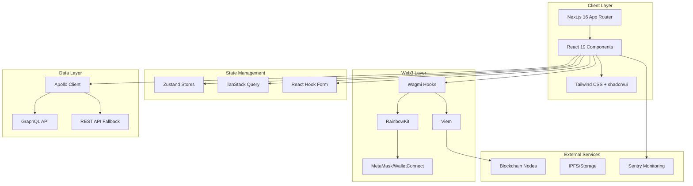
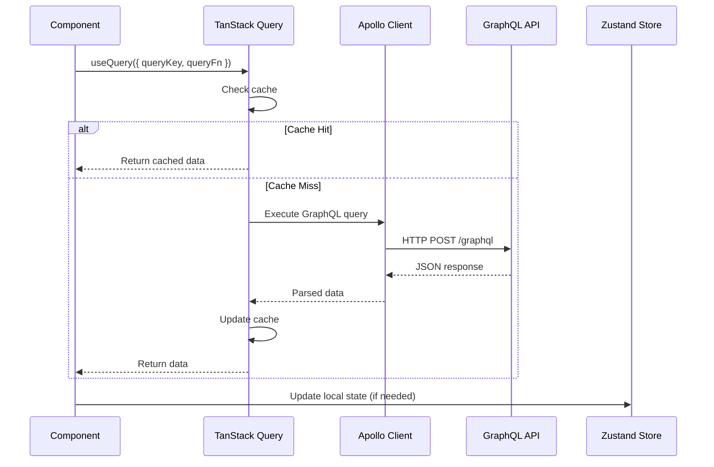
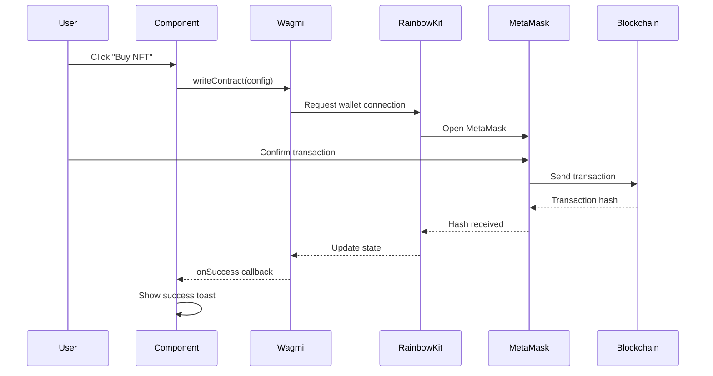
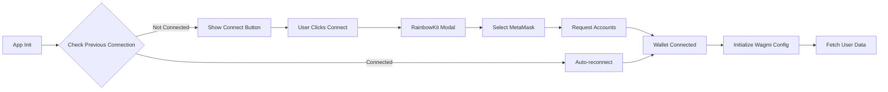
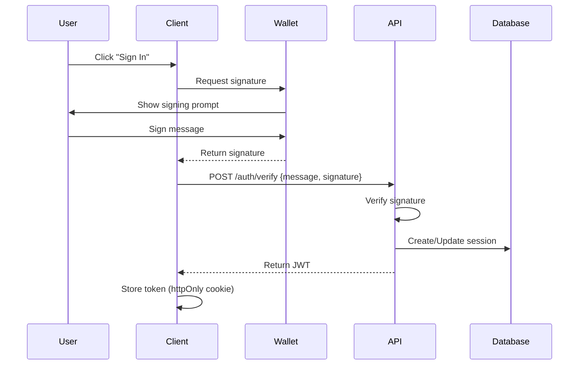

# Zuno Marketplace UI - System Architecture

**Version**: 0.1.0
**Last Updated**: 2026-01-31
**Architecture**: Next.js App Router + Modular Feature Architecture

---

## 1. High-Level Architecture



---

## 2. Application Layers

### 2.1 Presentation Layer

```
┌─────────────────────────────────────────────────────────────┐
│  PRESENTATION LAYER                                          │
│  ─────────────────                                           │
│  • Next.js App Router (App Router pattern)                   │
│  • Server Components (default)                               │
│  • Client Components (interactive features)                  │
│  • Layouts & Loading States                                  │
└─────────────────────────────────────────────────────────────┘
```

**Key Technologies**:
- Next.js 16 with App Router
- React Server Components
- Streaming SSR
- Route Groups: `(analytics)`, `(creator)`, `(discover)`, `(marketplace)`, `(user)`

### 2.2 Feature Module Layer

```
┌─────────────────────────────────────────────────────────────┐
│  FEATURE MODULE LAYER                                        │
│  ───────────────────                                         │
│  • Self-contained business logic                             │
│  • Module-specific components, hooks, stores                 │
│  • Clear public API via index.ts exports                     │
└─────────────────────────────────────────────────────────────┘
```

**Modules**:
| Module | Responsibility | Key Exports |
|--------|----------------|-------------|
| `marketplace` | NFT trading | `ListingCard`, `useListings` |
| `auctions` | Auction system | `BidForm`, `useAuction` |
| `collections` | Collection browsing | `CollectionGrid`, `useCollections` |
| `profile` | User management | `ProfileCard`, `useProfile` |
| `wallets` | Wallet integration | `ConnectButton`, `useWallet` |
| `create` | NFT minting | `MintForm`, `useMint` |

### 2.3 Shared Layer

```
┌─────────────────────────────────────────────────────────────┐
│  SHARED LAYER                                                │
│  ────────────                                                │
│  • Cross-cutting concerns                                    │
│  • UI component library (shadcn/ui)                          │
│  • Utilities & helpers                                       │
│  • API clients & configuration                               │
└─────────────────────────────────────────────────────────────┘
```

---

## 3. Data Flow Architecture

### 3.1 Server State Flow (TanStack Query)



### 3.2 Web3 Transaction Flow



---

## 4. State Management Architecture

### 4.1 State Categories

| State Type | Technology | Use Case |
|------------|------------|----------|
| **Server State** | TanStack Query | API data, caching, background updates |
| **Global UI State** | Zustand | Theme, wallet connection, user preferences |
| **Form State** | React Hook Form | Form inputs, validation |
| **Local State** | useState | Component-specific UI state |
| **URL State** | Next.js Router | Filters, pagination, search params |

### 4.2 Zustand Store Structure

```typescript
// shared/stores/
├── wallet-store.ts      // Wallet connection state
├── user-store.ts        // User profile data
├── ui-store.ts          // UI preferences (theme, sidebar)
└── cart-store.ts        // Shopping cart / selected items
```

```typescript
// Example: wallet-store.ts
import { create } from 'zustand';

interface WalletState {
  // State
  address: `0x${string}` | null;
  chainId: number | null;
  isConnected: boolean;

  // Actions
  connect: (address: `0x${string}`, chainId: number) => void;
  disconnect: () => void;
  switchChain: (chainId: number) => void;
}

export const useWalletStore = create<WalletState>((set) => ({
  address: null,
  chainId: null,
  isConnected: false,
  connect: (address, chainId) => set({ address, chainId, isConnected: true }),
  disconnect: () => set({ address: null, chainId: null, isConnected: false }),
  switchChain: (chainId) => set({ chainId }),
}));
```

---

## 5. Web3 Integration Architecture

### 5.1 Wallet Connection Flow



### 5.2 Supported Chains

| Chain | ID | Environment | RPC |
|-------|-----|-------------|-----|
| Anvil (Local) | 31337 | Development | `http://127.0.0.1:8545` |
| Sepolia | 11155111 | Testnet | Public RPC |

### 5.3 Web3 Configuration

```typescript
// shared/config/wagmi.ts
import { createConfig, http } from 'wagmi';
import { sepolia } from 'wagmi/chains';
import { connectorsForWallets } from '@rainbow-me/rainbowkit';
import { metaMaskWallet } from '@rainbow-me/rainbowkit/wallets';

const connectors = connectorsForWallets(
  [{ groupName: 'Recommended', wallets: [metaMaskWallet] }],
  { appName: 'Zuno Marketplace', projectId }
);

export const wagmiConfig = createConfig({
  connectors,
  chains: [anvil, sepolia],
  ssr: true,
  transports: {
    [anvil.id]: http(),
    [sepolia.id]: http(),
  },
});
```

---

## 6. API Communication Architecture

### 6.1 GraphQL Layer

```
┌─────────────────────────────────────────────────────────────┐
│  GRAPHQL ARCHITECTURE                                        │
├─────────────────────────────────────────────────────────────┤
│                                                              │
│  Client                      Server                         │
│  ─────                       ──────                         │
│  ┌──────────────┐           ┌──────────────┐               │
│  │   React      │◄─────────►│ Apollo Client│               │
│  │ Components   │  Hooks    │              │               │
│  └──────────────┘           └──────┬───────┘               │
│                                    │                        │
│  ┌──────────────┐           ┌──────▼───────┐               │
│  │ Generated    │           │ GraphQL      │               │
│  │ Types/Hooks  │           │ HTTP Request │               │
│  └──────────────┘           └──────┬───────┘               │
│                                    │                        │
│                                    ▼                        │
│                           ┌──────────────┐                 │
│                           │ GraphQL API  │                 │
│                           │ Server       │                 │
│                           └──────────────┘                 │
│                                                              │
└─────────────────────────────────────────────────────────────┘
```

### 6.2 Code Generation

GraphQL types and hooks are auto-generated:

```bash
# Generate from schemas
pnpm codegen

# Watch mode for development
pnpm codegen:watch
```

Output: `src/shared/graphql/generated/` (types, hooks, documents)

---

## 7. Component Architecture

### 7.1 Component Hierarchy

```
Page (Server)
└── Layout (Server)
    └── Feature Container (Client/Server)
        ├── UI Components (Client)
        │   ├── shadcn/ui primitives
        │   └── Custom components
        └── Business Logic Hooks
            ├── useQuery (TanStack)
            ├── useContract (Wagmi)
            └── useStore (Zustand)
```

### 7.2 Component Types

| Type | Location | Example | Responsibility |
|------|----------|---------|----------------|
| **Page** | `app/**/page.tsx` | `marketplace/page.tsx` | Route entry, data fetching |
| **Layout** | `app/**/layout.tsx` | `(marketplace)/layout.tsx` | Shared UI wrapper |
| **Feature** | `modules/*/components/` | `ListingCard.tsx` | Business logic components |
| **UI Primitive** | `shared/components/ui/` | `Button.tsx` | Reusable UI elements |
| **Hook** | `shared/hooks/` or `modules/*/hooks/` | `use-wallet.ts` | Reusable logic |

---

## 8. Security Architecture

### 8.1 Authentication Flow (SIWE)



### 8.2 Environment Variable Security

| Variable Type | Prefix | Example | Storage |
|---------------|--------|---------|---------|
| Public | `NEXT_PUBLIC_` | `NEXT_PUBLIC_API_URL` | Client + Server |
| Private | None | `SENTRY_AUTH_TOKEN` | Server only |

---

## 9. Monitoring & Observability

### 9.1 Sentry Integration

```typescript
// sentry.config.ts
import * as Sentry from '@sentry/nextjs';

Sentry.init({
  dsn: process.env.SENTRY_DSN,
  tracesSampleRate: 1.0,
  debug: false,
});
```

### 9.2 Error Boundaries

- Global error boundary in `app/error.tsx`
- Sentry error reporting for production
- User-friendly error messages

---

## 10. Performance Architecture

### 10.1 Optimization Strategies

| Strategy | Implementation | Benefit |
|----------|----------------|---------|
| **Code Splitting** | Next.js automatic | Reduced initial bundle |
| **Lazy Loading** | `dynamic()` imports | On-demand component loading |
| **Image Optimization** | `next/image` | Automatic resizing, WebP |
| **Font Optimization** | `next/font` | Zero layout shift |
| **Caching** | TanStack Query | Reduced API calls |
| **Streaming** | React Suspense | Progressive loading |

### 10.2 Bundle Analysis

```bash
# Analyze bundle size
pnpm build
# Review .next/analyze/ output
```
