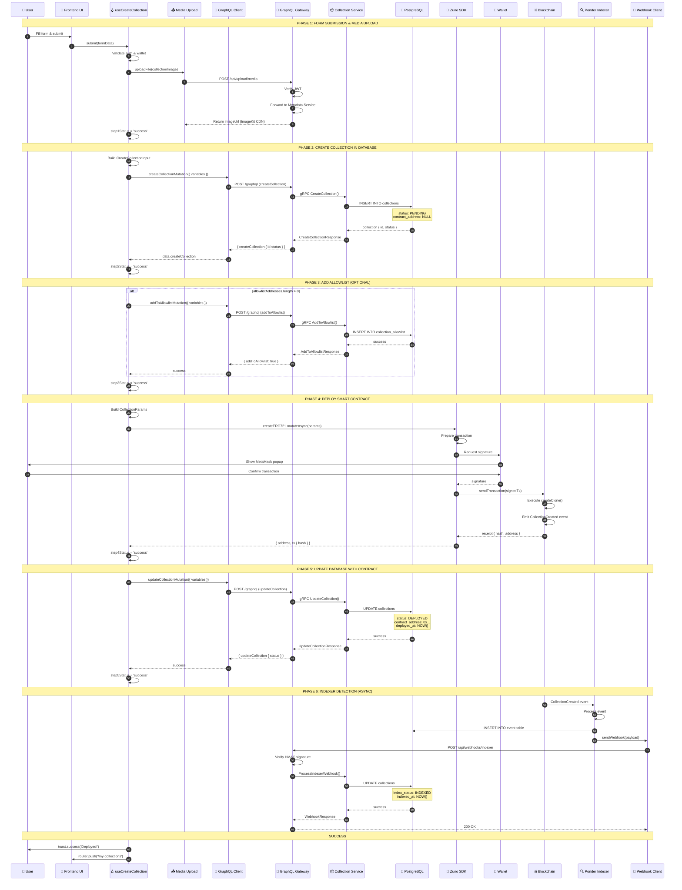
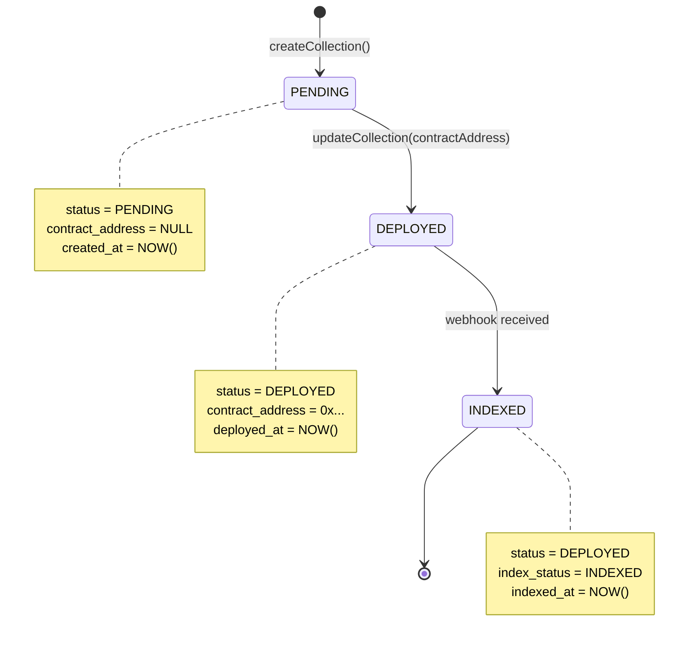
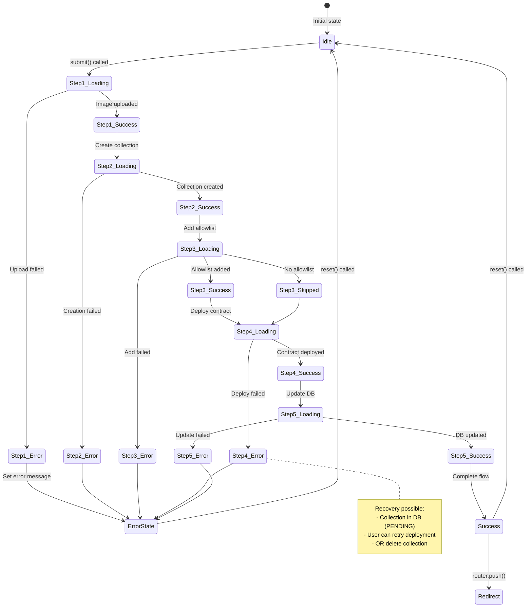
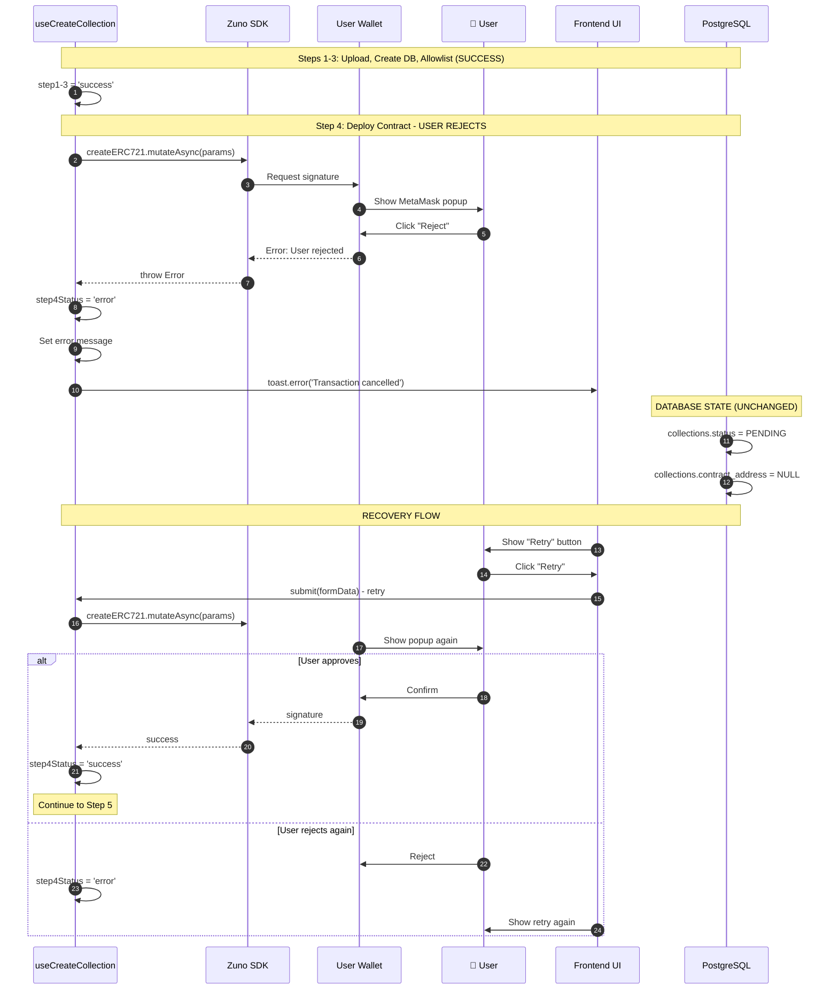
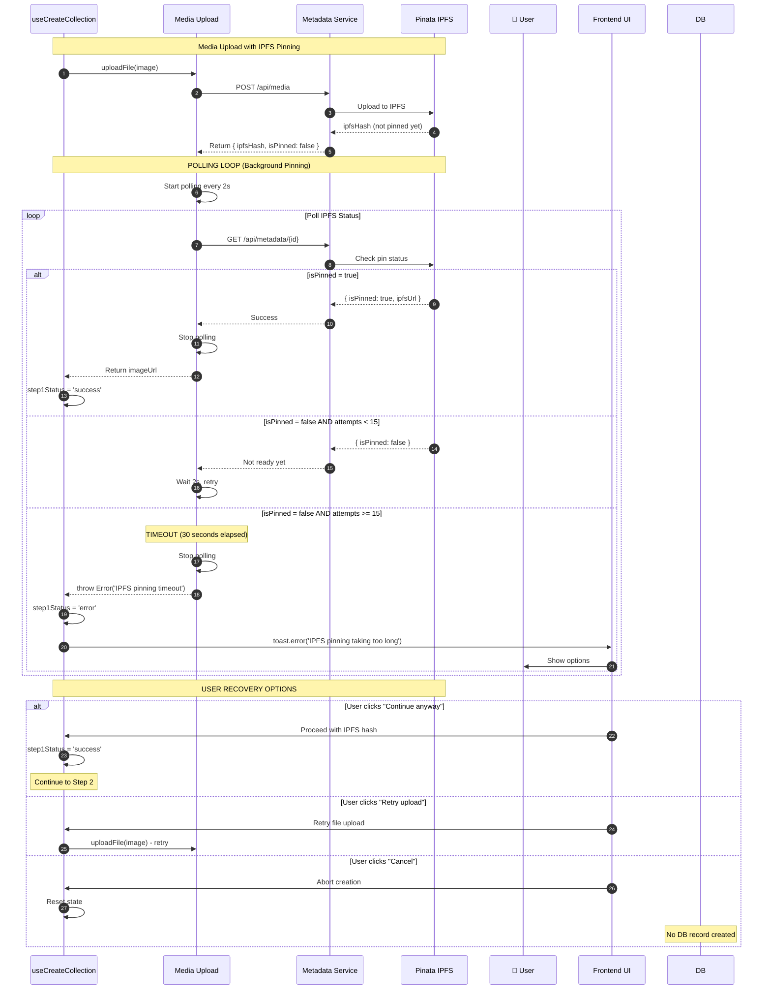
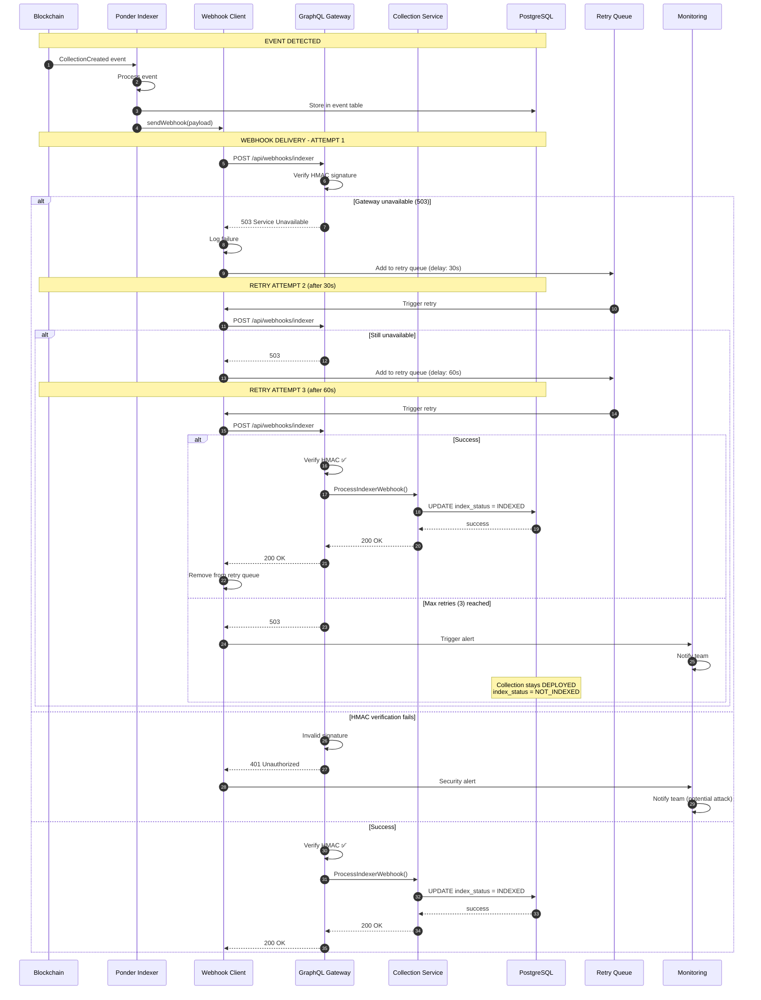
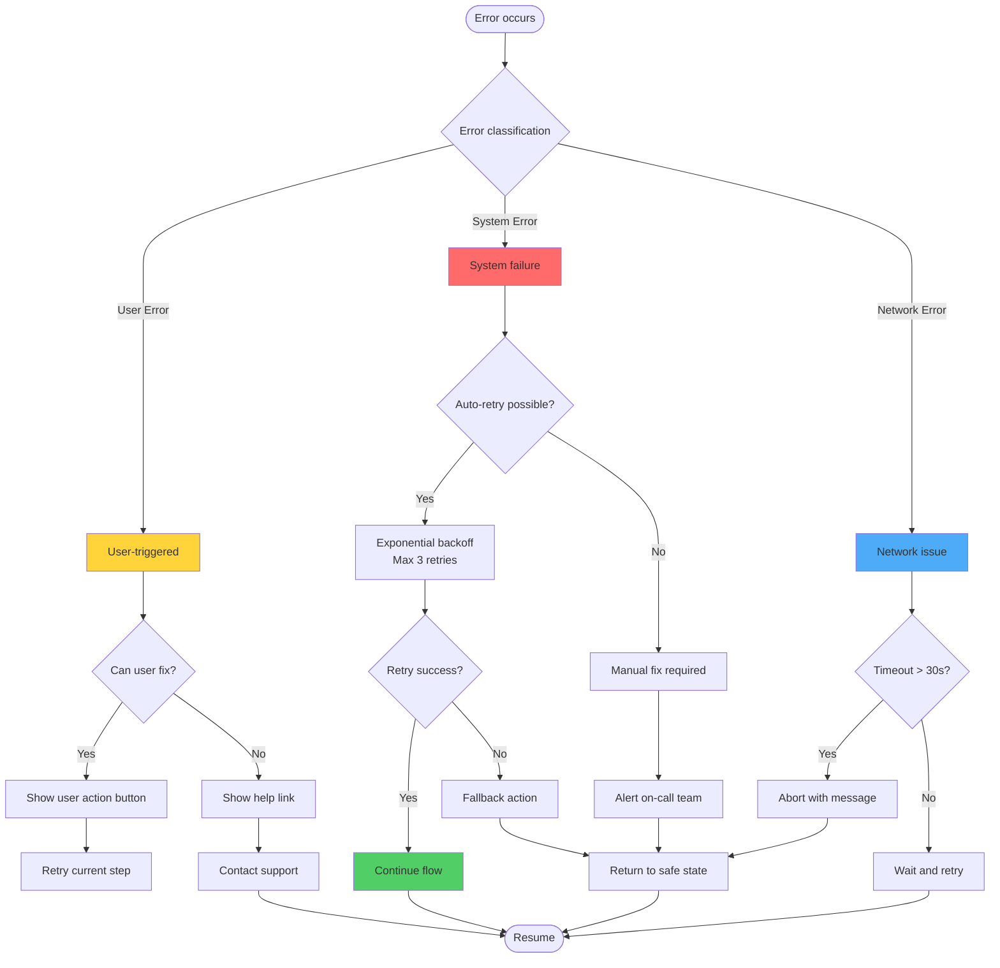
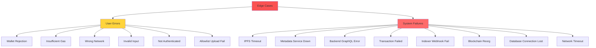

# Create Collection - Diagrams Quick Reference

**Quick access to all Mermaid v11 diagrams from the workflow documentation.**

---

## 1. Happy Path - Sequence Diagram

**Complete success flow with all 6 phases**

---

## 2. Database State Transitions

**Collection status lifecycle**

---

## 3. Frontend Hook State Machine

**useCreateCollection internal states**

---

## 4. Edge Case: Wallet Rejection

**User cancels MetaMask transaction**

---

## 5. Edge Case: IPFS Pinning Timeout

**Background pinning takes too long**

---

## 6. Edge Case: Indexer Webhook Failure

**Webhook delivery with retry logic**

---

## 7. Error Recovery Decision Tree

**How errors are classified and recovered**

---

## 8. Edge Case Classification Overview

**All edge cases categorized**

---

## Quick Navigation

- **Happy Path**: See diagram #1 (Sequence) or #2 (State)
- **User Errors**: See diagrams #4 (Wallet Rejection), #7 (Recovery Tree)
- **System Failures**: See diagrams #5 (IPFS Timeout), #6 (Webhook Failure)
- **All Edge Cases**: See diagram #8 (Classification)

---

**Reference Version**: 1.0
**Last Updated**: 2026-01-27
