# Create Collection Feature - Comprehensive Workflow Documentation

**Date**: 2026-01-27
**Status**: Draft
**Purpose**: Documentation + Implementation Plan
**Scope**: Happy Path + All Edge Cases (Detailed)

---

## Table of Contents

1. [Architecture Overview](#architecture-overview)
2. [Happy Path Workflow](#happy-path-workflow)
3. [Edge Case Workflows](#edge-case-workflows)
4. [Component State Transitions](#component-state-transitions)
5. [API Specifications](#api-specifications)
6. [Error Handling Matrix](#error-handling-matrix)
7. [Implementation Checklist](#implementation-checklist)

---

## Architecture Overview

### System Components

```
┌─────────────────────────────────────────────────────────────────────────────┐
│                         CREATE COLLECTION ECOSYSTEM                          │
├─────────────────────────────────────────────────────────────────────────────┤
│                                                                              │
│  ┌──────────────┐     ┌──────────────┐     ┌──────────────┐                │
│  │   Frontend   │────▶│   Backend    │────▶│  Blockchain  │                │
│  │  (Next.js)   │     │  (Go gRPC)   │     │  (Ethereum)  │                │
│  │              │     │              │     │              │                │
│  │  ┌────────┐  │     │  ┌────────┐  │     │  ┌────────┐  │                │
│  │  │  UI    │  │     │  │ GraphQL│  │     │  │Factory │  │                │
│  │  │  Form  │  │     │  │ Gateway│  │     │  │Contract│  │                │
│  │  └────────┘  │     │  └────────┘  │     │  └────────┘  │                │
│  │  ┌────────┐  │     │  ┌────────┐  │     │              │                │
│  │  │   SDK  │  │     │  │Collection│     │              │                │
│  │  │Provider│  │     │  │ Service │  │     │              │                │
│  │  └────────┘  │     │  └────────┘  │     │              │                │
│  │  ┌────────┐  │     │              │     │              │                │
│  │  │Apollo  │  │     │              │     │              │                │
│  │  │Client  │  │     │              │     │              │                │
│  │  └────────┘  │     │              │     │              │                │
│  └──────────────┘     └──────────────┘     └──────────────┘                │
│         │                     │                     ▲                       │
│         │                     │                     │                       │
│         ▼                     ▼                     │                       │
│  ┌──────────────┐     ┌──────────────┐             │                       │
│  │    Wallet    │     │   Metadata   │─────────────┘                       │
│  │  (RainbowKit)│     │   Service    │     Events Emitted                 │
│  │              │     │ (IPFS/ImgKit) │                                      │
│  └──────────────┘     └──────────────┘                                      │
│         │                     │                                              │
│         ▼                     ▼                                              │
│  ┌──────────────┐     ┌──────────────┐                                      │
│  │     User     │     │     IPFS     │                                      │
│  │  Signature   │     │   (Pinata)   │                                      │
│  └──────────────┘     └──────────────┘                                      │
│                                                                              │
│                           ┌──────────────┐                                   │
│                           │   Indexer    │                                   │
│                           │   (Ponder)   │                                   │
│                           │              │                                   │
│                           │  ┌────────┐  │                                   │
│                           │  │Webhook │  │                                   │
│                           │  │ Client │──┼───To Backend                     │
│                           │  └────────┘  │                                   │
│                           └──────────────┘                                   │
└─────────────────────────────────────────────────────────────────────────────┘
```

### Data Flow Summary

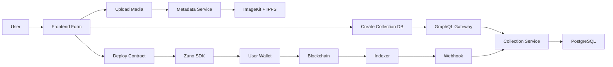

---

## Happy Path Workflow

### Complete Success Flow - Sequence Diagram

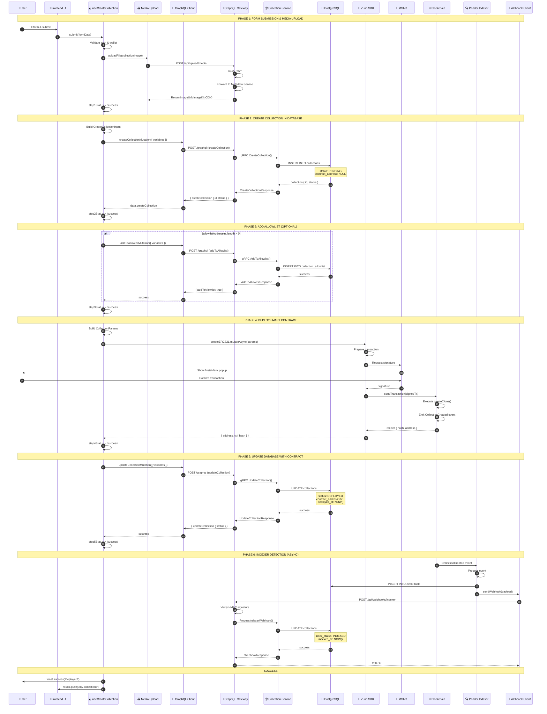

### Database State Transitions - Happy Path

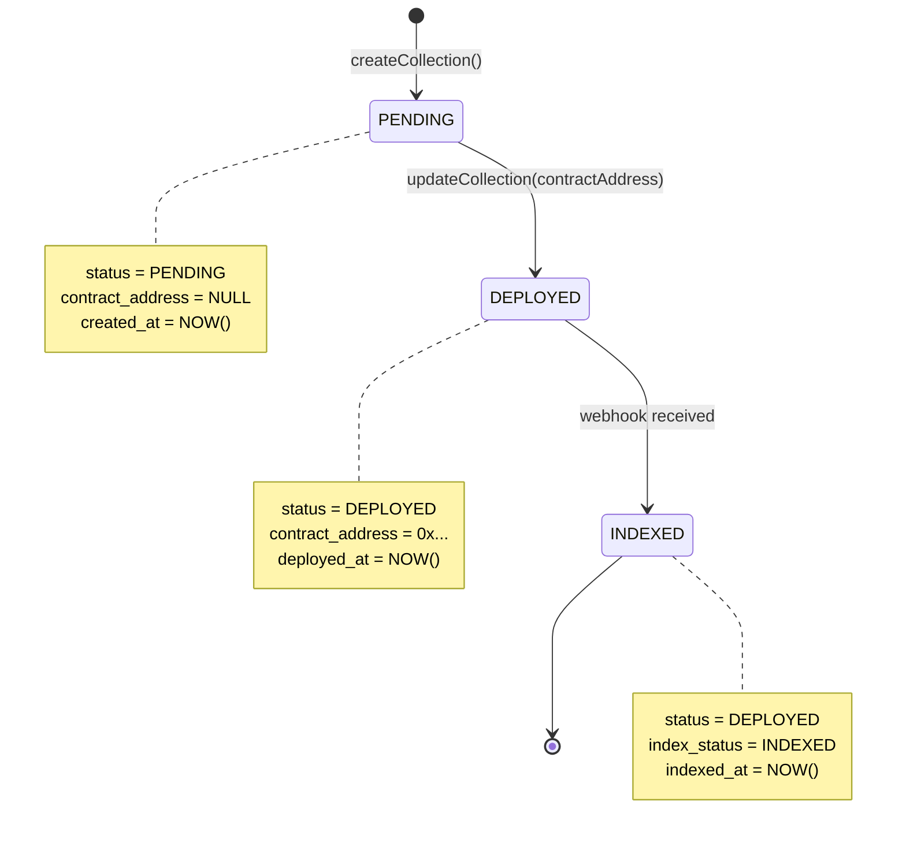

---

## Edge Case Workflows

### Edge Case Classification

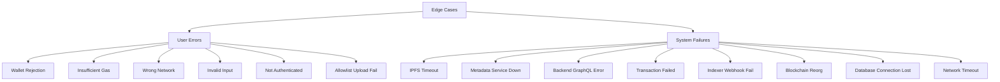

### Edge Case 1: User Rejects Wallet Signature

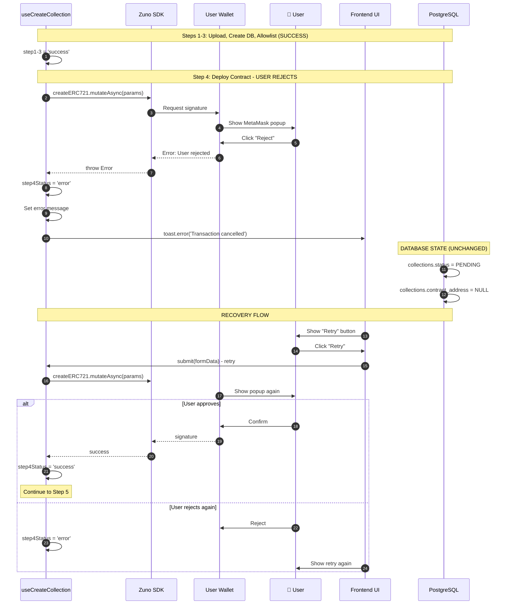

### Edge Case 2: Insufficient Gas Funds

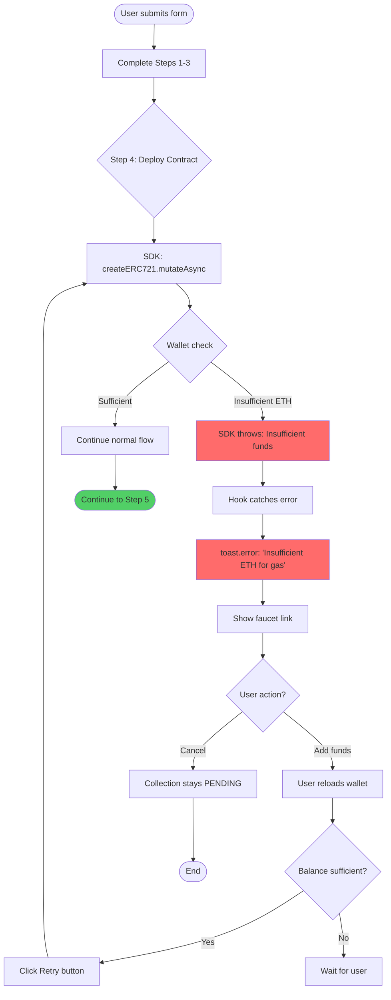

### Edge Case 3: IPFS Pinning Timeout

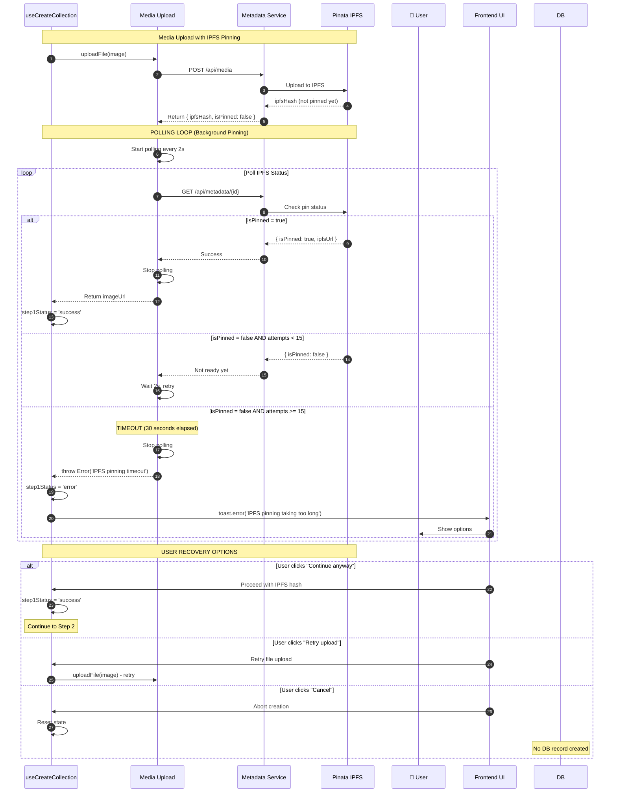

### Edge Case 4: Transaction Failed on Blockchain

```mermaid
stateDiagram-v2
    [*] --> Step4_Complete: Step 4 completes
    Step4_Complete --> Step5_Started: Step 5 starts

    Step5_Started --> CallUpdate: updateCollectionMutation
    CallUpdate --> SendingTx: Send transaction to blockchain

    SendingTx --> TxResult{Transaction result?}

    TxResult --> Success: Transaction confirmed
    TxResult --> Failed: Transaction reverted
    TxResult --> Dropped: Transaction dropped

    Success --> DBUpdate: Update DB with contract address
    DBUpdate --> Deployed: status = DEPLOYED

    Failed --> ErrorHandling: Error handler
    Dropped --> ErrorHandling: Error handler

    ErrorHandling --> LogError: Log error with details
    LogError --> NotifyUser: toast.error with reason
    NotifyUser --> Recovery{Recovery option?}

    Recovery --> Retry: User clicks Retry
    Recovery --> Abort: User cancels

    Retry --> CallUpdate: Retry Step 5
    Abort --> Stuck: status = PENDING, no contract

    Deployed --> [*]
    Stuck --> [*]

    note right of Failed
        Common reasons:
        - Out of gas
        - Contract reverted
        - Nonce mismatch
        - Network congestion
    end note

    note right of Stuck
        Manual cleanup required:
        - Delete collection record
        - OR retry deployment
    end note
```

### Edge Case 5: Indexer Webhook Failure

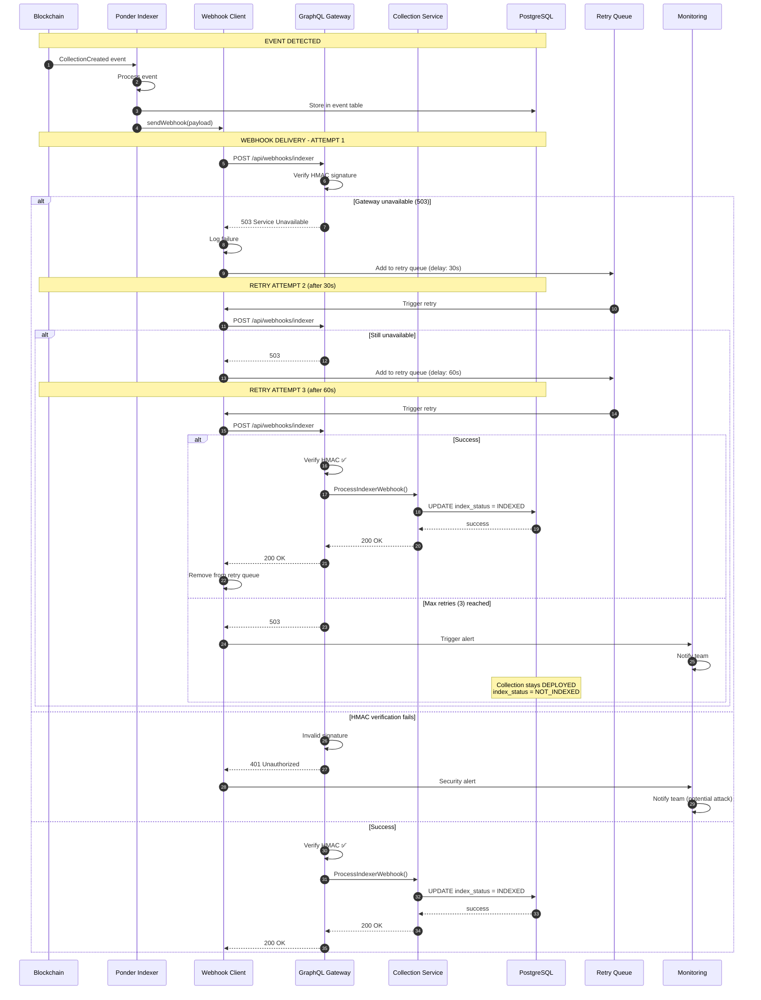

### Edge Case 6: Metadata Service Down

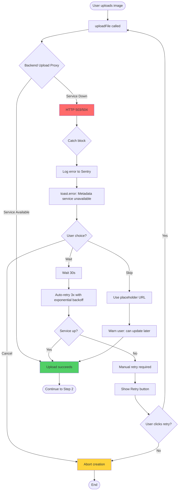

### Edge Case 7: Blockchain Reorg

```mermaid
stateDiagram-v2
    [*] --> Deployed: Contract deployed
    Deployed --> Indexed: Indexer confirms

    Indexed --> ReorgDetected: Blockchain reorg detected
    ReorgDetected --> CheckDepth{Reorg depth?}

    CheckDepth -->|Shallow < 6 blocks| Rollback: Roll back indexer state
    CheckDepth -->|Deep >= 6 blocks| ManualReview: Flag for manual review

    Rollback --> RevertIndexer: Revert event table
    RevertIndexer --> CheckDB{DB contract exists?}

    CheckDB -->|Yes| KeepDB: Keep DB record (status=DEPLOYED)
    CheckDB -->|No| NoAction: No action needed

    KeepDB --> FlagIndex: Set index_status = REORG
    FlagIndex --> Notify: Notify backend via webhook
    Notify --> BackendVerify: Backend verifies on-chain

    BackendVerify --> StillExists{Contract still on-chain?}

    StillExists -->|Yes| Restore: Restore index_status = INDEXED
    StillExists -->|No| DeleteRec: Delete DB record or mark INVALID

    Restore --> [*]
    DeleteRec --> [*]
    ManualReview --> [*]

    note right of ReorgDetected
        Reorg detection:
        - Ponder detects chain reorg
        - Block hash mismatch
        - Event disappears from chain
    end note

    note right of FlagIndex
        New status values:
        - REORG: Reorg detected, verifying
        - INVALID: Contract no longer exists
    end note
```

### Edge Case 8: Database Connection Lost

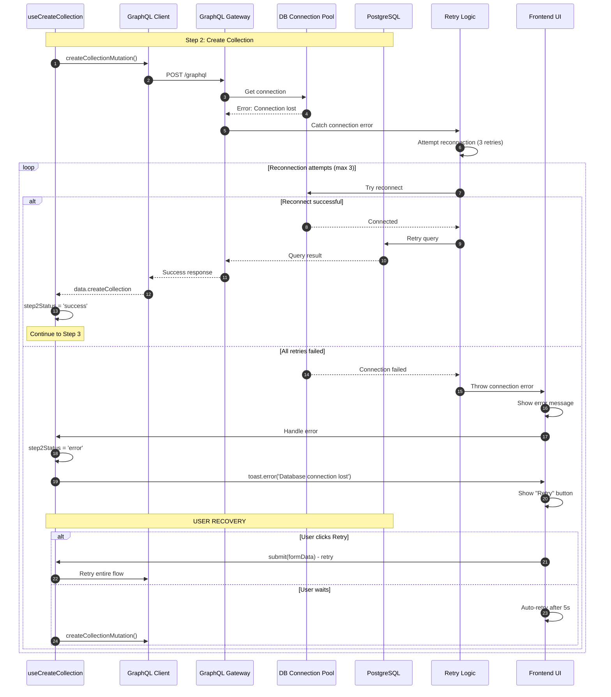

---

## Component State Transitions

### Frontend Hook State Machine

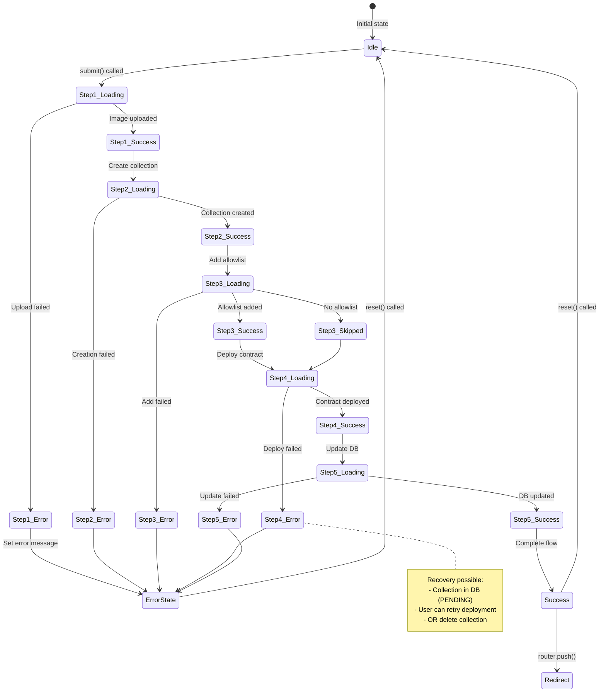

### Collection Status State Machine

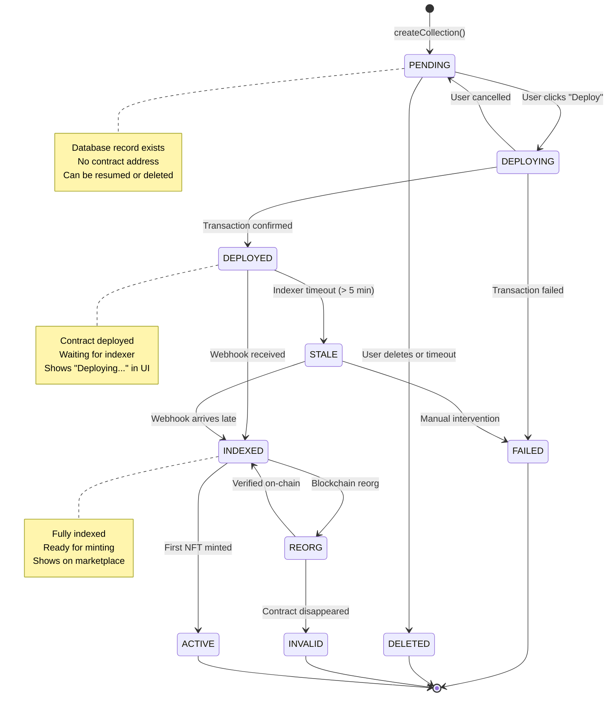

---

## API Specifications

### GraphQL Mutations

#### 1. createCollection

```graphql
mutation CreateCollection($input: CreateCollectionInput!) {
  createCollection(input: $input) {
    id
    name
    symbol
    status
    contractAddress
    chainId
    tokenStandard
    imageUrl
    baseUri
    maxSupply
    mintPriceAllowlist
    mintPricePublic
    royaltyFeeBps
    createdAt
  }
}

input CreateCollectionInput {
  name: String!
  symbol: String!
  description: String
  chainId: String!
  tokenStandard: ApiTokenStandard!
  deployerAddress: String!
  imageUrl: String
  baseUri: String!
  maxSupply: Int!
  mintPriceAllowlist: String!
  mintPricePublic: String!
  mintStartTime: DateTime!
  allowlistStageEnd: DateTime
  mintLimitPerWallet: Int!
  royaltyFeeBps: Int!
  royaltyRecipient: String!
}

enum ApiTokenStandard {
  ERC721
  ERC1155
}

enum CollectionStatus {
  PENDING
  DEPLOYING
  DEPLOYED
  INDEXED
  ACTIVE
  FAILED
  INVALID
  REORG
}
```

#### 2. updateCollection

```graphql
mutation UpdateCollection($id: ID!, $input: UpdateCollectionInput!) {
  updateCollection(id: $id, input: $input) {
    id
    status
    contractAddress
    deployedAt
    indexedAt
  }
}

input UpdateCollectionInput {
  contractAddress: String
  status: CollectionStatus
  deployedAt: DateTime
}
```

#### 3. addToAllowlist

```graphql
mutation AddToAllowlist($input: AddToAllowlistInput!) {
  addToAllowlist(input: $input)
}

input AddToAllowlistInput {
  collectionId: ID!
  walletAddresses: [String!]!
  maxMintAmount: Int!
}
```

### SDK Methods

#### createERC721Collection

```typescript
interface CollectionParams {
  name: string;
  symbol: string;
  description?: string;
  tokenURI: string;
  maxSupply: number;
  mintPrice: string;
  allowlistMintPrice: string;
  publicMintPrice: string;
  royaltyFee: number; // basis points (500 = 5%)
  mintLimitPerWallet: number;
  allowlistStageDuration: number; // seconds
}

interface DeployResult {
  address: `0x${string}`;
  tx: {
    hash: `0x${string}`;
    chainId: number;
    blockNumber?: number;
  };
}

const { createERC721 } = useCollection();

const result: DeployResult = await createERC721.mutateAsync(params);
```

### Backend Upload Proxy Endpoints

#### POST /api/upload/media

```http
POST /api/upload/media HTTP/1.1
Host: localhost:8081
Authorization: Bearer <JWT_TOKEN>
Content-Type: multipart/form-data

------Boundary
Content-Disposition: form-data; name="file"; filename="logo.png"
Content-Type: image/png

<binary data>
------Boundary--

Response:
{
  "success": true,
  "data": {
    "url": "https://ik.imagekit.io/zuno/logo.png",
    "ipfsHash": "QmXyz...",
    "ipfsUrl": "https://gateway.pinata.cloud/ipfs/QmXyz..."
  }
}
```

#### GET /api/upload/metadata/:id

```http
GET /api/upload/metadata/metadata_abc123 HTTP/1.1
Host: localhost:8081
Authorization: Bearer <JWT_TOKEN>

Response (polling):
{
  "id": "metadata_abc123",
  "isPinned": false,
  "ipfsHash": null,
  "ipfsUrl": null
}

Response (pinned):
{
  "id": "metadata_abc123",
  "isPinned": true,
  "ipfsHash": "QmXyz...",
  "ipfsUrl": "https://gateway.pinata.cloud/ipfs/QmXyz...",
  "pinnedAt": "2025-01-27T10:30:00Z"
}
```

### Indexer Webhook

#### POST /api/webhooks/indexer

```http
POST /api/webhooks/indexer HTTP/1.1
Host: localhost:8081
Content-Type: application/json
X-Webhook-Signature: sha256=<HMAC_SIGNATURE>
X-Webhook-Event: collection.created

{
  "event": "collection.created",
  "chainId": 11155111,
  "timestamp": 1737970800,
  "data": {
    "collectionAddress": "0xABC...",
    "creator": "0x123...",
    "tokenType": "ERC721",
    "blockNumber": 12345678,
    "txHash": "0xDEF..."
  }
}

Response:
HTTP/1.1 200 OK
{
  "success": true
}
```

---

## Error Handling Matrix

### Error Codes and Messages

| Error Code | Message | HTTP Status | Recovery Action | Component |
|------------|---------|-------------|-----------------|-----------|
| `ERR_AUTH_REQUIRED` | Please sign in first | 401 | Redirect to sign-in | Frontend |
| `ERR_WALLET_NOT_CONNECTED` | Wallet not connected | 400 | Show connect button | Frontend |
| `ERR_UPLOAD_FAILED` | Failed to upload image | 500 | Retry upload | Frontend/Metadata |
| `ERR_IPFS_TIMEOUT` | IPFS pinning timeout | 408 | Continue anyway or retry | Frontend |
| `ERR_COLLECTION_EXISTS` | Collection name already exists | 409 | Choose different name | Backend |
| `ERR_INVALID_INPUT` | Invalid form data | 400 | Show validation errors | Frontend |
| `ERR_WALLET_REJECTED` | Transaction rejected by user | 499 | Show retry button | Frontend/SDK |
| `ERR_INSUFFICIENT_GAS` | Insufficient ETH for gas | 400 | Show faucet link | Frontend/SDK |
| `ERR_WRONG_NETWORK` | Please switch to Sepolia | 400 | Trigger network switch | Frontend/SDK |
| `ERR_TX_FAILED` | Transaction failed: {reason} | 500 | Retry or contact support | SDK/Blockchain |
| `ERR_DB_CONNECTION` | Database connection lost | 503 | Auto-retry 3x | Backend |
| `ERR_WEBHOOK_FAILED` | Indexer webhook failed | 503 | Queue for retry | Indexer |
| `ERR_SERVICE_UNAVAILABLE` | Metadata service unavailable | 503 | Retry with backoff | Backend/Metadata |
| `ERR_HMAC_INVALID` | Invalid webhook signature | 401 | Block request | Backend |
| `ERR_REORG_DETECTED` | Blockchain reorganization | 500 | Manual review required | Indexer |

### Error Recovery Decision Tree

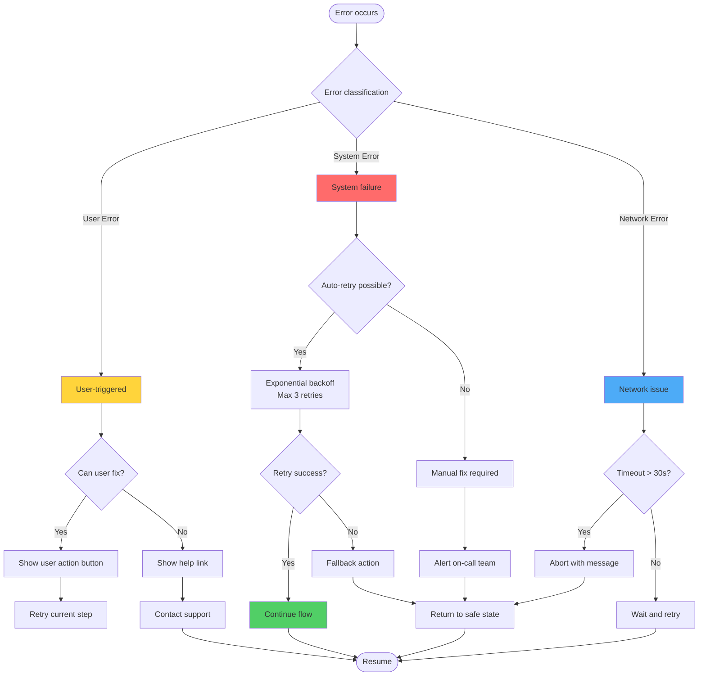

---

## Implementation Checklist

### Frontend Implementation (zuno-marketplace-ui)

#### Status: ✅ Partially Complete | ⏳ In Progress | ❌ Not Started

- [✅] **Step 1: UI Components**
  - [✅] CollectionForm component
  - [✅] CreateCollectionForm component
  - [✅] Multi-step form UI
  - [⏳] Progress indicators for each step
  - [⏳] Error state displays
  - [⏳] Recovery action buttons

- [✅] **Step 2: Hooks**
  - [✅] useCreateCollection hook
  - [✅] Step 1: Media upload
  - [✅] Step 2: Create collection in DB
  - [✅] Step 3: Add allowlist
  - [✅] Step 4: Deploy contract via SDK
  - [✅] Step 5: Update DB with contract
  - [⏳] Error handling for each step
  - [⏳] Retry logic

- [⏳] **Step 3: SDK Integration**
  - [✅] ZunoProvider wrapper
  - [✅] SDK hooks imported
  - [⏳] Wallet signature handling
  - [⏳] Transaction status monitoring
  - [⏳] Gas estimation UI

- [⏳] **Step 4: Error Handling**
  - [⏳] Wallet rejection handling
  - [⏳] Insufficient gas detection
  - [⏳] Network switch prompts
  - [⏳] IPFS timeout handling
  - [⏳] Transaction failure recovery

- [⏳] **Step 5: User Feedback**
  - [⏳] Toast notifications
  - [⏳] Progress indicators
  - [⏳] Transaction hash display
  - [⏳] Block explorer links
  - [⏳] Retry/Cancel buttons

### Backend Implementation (zuno-marketplace-api)

#### Status: ✅ Complete | ⏳ In Progress | ❌ Not Started

- [✅] **Step 1: Collection Service**
  - [✅] gRPC proto definitions
  - [✅] Repository layer
  - [✅] Service layer
  - [✅] gRPC server
  - [✅] Database models

- [✅] **Step 2: GraphQL Gateway**
  - [✅] GraphQL schema
  - [✅] createCollection resolver
  - [✅] updateCollection resolver
  - [✅] addToAllowlist resolver
  - [✅] Query resolvers

- [⏳] **Step 3: Webhook Handler**
  - [❌] Webhook endpoint implementation
  - [❌] HMAC signature verification
  - [❌] Event processing logic
  - [❌] Index status updates
  - [❌] Error handling

- [✅] **Step 4: Upload Proxy**
  - [✅] Media upload endpoint
  - [✅] Metadata creation endpoint
  - [✅] Polling endpoint
  - [✅] JWT authentication
  - [✅] API key forwarding

- [⏳] **Step 5: Error Handling**
  - [⏳] Connection pool management
  - [⏳] Retry logic
  - [⏳] Error logging
  - [⏳] Monitoring integration

### Indexer Implementation (zuno-marketplace-indexer)

#### Status: ✅ Complete | ⏳ In Progress | ❌ Not Started

- [✅] **Step 1: Event Indexing**
  - [✅] Ponder setup
  - [✅] Factory contract indexing
  - [✅] Event handlers
  - [✅] Database storage

- [❌] **Step 2: Webhook System**
  - [❌] Webhook client implementation
  - [❌] HMAC signature generation
  - [❌] Retry queue
  - [❌] Delivery tracking

- [❌] **Step 3: Error Handling**
  - [❌] Webhook failure handling
  - [❌] Reorg detection
  - [❌] Event replay logic

### Integration Tasks

- [⏳] **End-to-End Testing**
  - [ ] Happy path test
  - [ ] Wallet rejection test
  - [ ] Insufficient gas test
  - [ ] IPFS timeout test
  - [ ] Webhook failure test
  - [ ] Reorg handling test

- [⏳] **Documentation**
  - [ ] API documentation
  - [ ] Error handling guide
  - [ ] Troubleshooting guide
  - [ ] Monitoring setup

---

## Unresolved Questions

1. **IPFS Pinning Timeout**: What should be the maximum polling duration before giving up? Currently 30 seconds. Should this be configurable?

2. **Webhook Retry Strategy**: What is the acceptable delay between indexer webhook retries? Currently 30s, 60s, then manual. Should we extend this?

3. **Reorg Recovery**: For deep reorgs (>= 6 blocks), should we automatically mark collections as INVALID or require manual review?

4. **Stuck Collections**: Collections stuck in PENDING status (e.g., user cancelled after DB record created) - should we have a cleanup job?

5. **Gas Estimation**: Should we show estimated gas cost before user confirms transaction?

6. **Concurrent Creation**: What happens if user tries to create multiple collections simultaneously? Should we prevent this?

7. **Allowlist Size**: What is the maximum allowlist size we should support? Current implementation has no limit.

8. **Metadata Service Fallback**: If metadata service is down, should we allow direct IPFS upload as fallback?

---

## Next Steps

1. **Immediate** (This Week)
   - Complete error handling in frontend hook
   - Implement retry logic with exponential backoff
   - Add progress indicators for each step

2. **Short-term** (Next 2 Weeks)
   - Implement webhook system in indexer
   - Add webhook handler in backend
   - Write integration tests

3. **Medium-term** (Next Month)
   - Add monitoring and alerting
   - Implement cleanup jobs for stuck collections
   - Write comprehensive documentation

---

**Document Version**: 1.0
**Last Updated**: 2026-01-27
**Next Review**: After implementation completion
