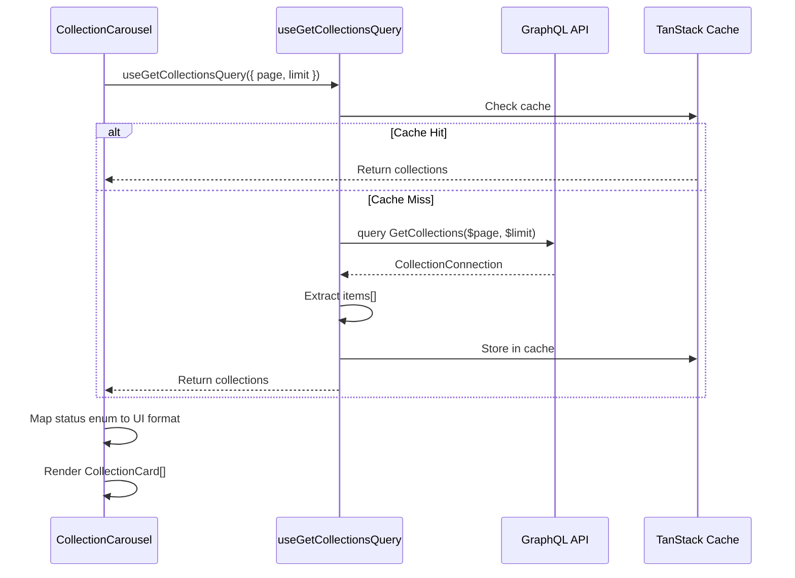

# Documentation Impact Analysis: Collection Display Feature

**Date:** 2026-02-06 15:33
**Branch:** feat/display-collection-home-page
**Worktree:** E:\worktrees\zuno-marketplace-ui-display-collection-home-page
**Agent:** docs-manager

---

## Executive Summary

**Question:** Are there any documentation files that need to be updated?

**Answer:** YES - Minor updates recommended to 2 documentation files.

The collection display feature represents an important milestone: **transition from mock data to real GraphQL integration**. While the changes are isolated to two component files, they represent a pattern that should be documented for future reference.

---

## Changes Overview

### Modified Files
1. **collection-carousel.tsx** - Replaced mock data with `useGetCollectionsQuery` GraphQL hook
2. **collection-card.tsx** - Updated to work with GraphQL Collection type

### Key Technical Changes
- Added GraphQL data fetching with proper loading/error/empty states
- Implemented status mapping from GraphQL enum to UI status
- Added proper null safety checks
- Uses generated TypeScript types from `@/shared/graphql/schema.generated`

---

## Documentation Impact Assessment

### Files Requiring Updates

#### 1. codebase-summary.md
**Impact:** MINOR
**Action:** Add note about GraphQL integration pattern

**Current State:**
- Section 3.2 lists `collections` module but doesn't mention GraphQL integration
- Section 4.2 shows data fetching patterns but doesn't include the carousel example

**Recommended Addition:**
```markdown
#### Collections Module
- **Purpose**: NFT collection browsing and management
- **Key Components**: Collection cards, grid layouts, filters
- **Dependencies**: `shared/components`, `shared/graphql`
- **Data Source**: GraphQL API via `useGetCollectionsQuery` (no longer uses mock data)
```

**Rationale:** The collection carousel is now a reference implementation for GraphQL integration.

---

#### 2. project-roadmap.md
**Impact:** MINOR
**Action:** Update Phase 1 status for "Collection browsing"

**Current State:**
- Line 45: "Collection browsing | In Progress | P0 | Feb 2026"

**Recommended Update:**
```markdown
| Feature | Status | Priority | Est. Completion |
|---------|--------|----------|-----------------|
| Collection browsing | ✅ Complete | P0 | Feb 2026 |
```

**Rationale:** The collection carousel now displays real data from GraphQL, completing the browsing foundation.

---

#### 3. system-architecture.md
**Impact:** OPTIONAL
**Action:** Consider adding data flow diagram for GraphQL collection fetching

**Current State:**
- Section 6.1 shows GraphQL architecture at high level
- Section 3.1 shows TanStack Query flow

**Optional Addition:**
```markdown
### 3.3 Collection Carousel Data Flow (Example)



**Rationale:** Provides concrete example of GraphQL integration pattern used in the codebase.

---

### Files NOT Requiring Updates

#### code-standards.md
**Reason:** The code follows existing patterns already documented:
- GraphQL hooks usage (Section 4.2)
- TypeScript standards (Section 2)
- Component patterns (Section 3)
- Error handling (Section 6)

#### project-overview-pdr.md
**Reason:** No changes to project goals, tech stack, or success criteria.

#### deployment-guide.md
**Reason:** No deployment-related changes in this feature.

#### design-guidelines.md
**Reason:** No new design patterns introduced (uses existing UI components).

#### guide-how-to-add-new-graphql-files-and-generate-hooks.md
**Reason:** The implementation follows the existing guide; no new patterns introduced.

---

## Documentation Quality: Current State

### Strengths
1. **GraphQL Guide Exists:** Clear instructions for adding GraphQL queries
2. **Type Safety Documented:** TypeScript standards are comprehensive
3. **Component Patterns:** Clear distinction between server/client components

### Gaps Identified
1. **No Reference Implementation:** The collection carousel is now the first real GraphQL integration example, but it's not mentioned in docs
2. **No Status Mapping Pattern:** The `mapStatusToUI` function is a useful pattern but not documented
3. **No Error Handling Examples:** The carousel's error state with retry is a good pattern to document

---

## Recommendations

### Priority 1: Update Codebase Summary
Add reference to the collection carousel as a GraphQL integration example.

### Priority 2: Update Roadmap
Mark "Collection browsing" as complete with note about GraphQL integration.

### Priority 3: Optional Enhancement
Consider creating a new guide: "docs/guide-graphql-integration-patterns.md" with examples:
- Data fetching with loading/error/empty states
- Status enum mapping
- Null safety patterns
- Type mapping between GraphQL and UI types

---

## Unresolved Questions

1. **Should we create a dedicated GraphQL integration patterns guide?**
   - Pro: Helps future developers follow the same pattern
   - Con: Might be over-engineering for a simple fetch-render pattern

2. **Should the status mapping function be documented as a reusable pattern?**
   - Other components may need similar enum-to-UI-status mapping

3. **Is there a plan to update other mock data usages to GraphQL?**
   - If yes, the collection carousel should be referenced as the pattern to follow

---

## Summary

**Documentation Impact:** MINOR

Two files should be updated:
1. **codebase-summary.md** - Add note about GraphQL integration in collections module
2. **project-roadmap.md** - Mark "Collection browsing" as complete

Optional enhancement: Create GraphQL integration patterns guide using collection carousel as reference example.

The code changes are well-contained and follow existing documentation standards. The main gap is that the **collection carousel is now a reference implementation** for GraphQL integration, but this isn't reflected in the docs.

---

## Files Analyzed

- E:\zuno-marketplace-ui\docs\codebase-summary.md
- E:\zuno-marketplace-ui\docs\code-standards.md
- E:\zuno-marketplace-ui\docs\system-architecture.md
- E:\zuno-marketplace-ui\docs\project-overview-pdr.md
- E:\zuno-marketplace-ui\docs\project-roadmap.md
- E:\zuno-marketplace-ui\docs\deployment-guide.md
- E:\zuno-marketplace-ui\docs\design-guidelines.md
- E:\zuno-marketplace-ui\docs\guide-how-to-add-new-graphql-files-and-generate-hooks.md
- E:\worktrees\zuno-marketplace-ui-display-collection-home-page\src\modules\product-discovery\collection-carousel\components\collection-carousel.tsx
- E:\worktrees\zuno-marketplace-ui-display-collection-home-page\src\modules\product-discovery\collection-carousel\components\collection-card.tsx
- E:\zuno-marketplace-ui\plans\reports\tester-260206-1528-collection-display-verification.md
- E:\zuno-marketplace-ui\plans\reports\tester-260206-1511-collection-display-implementation.md
